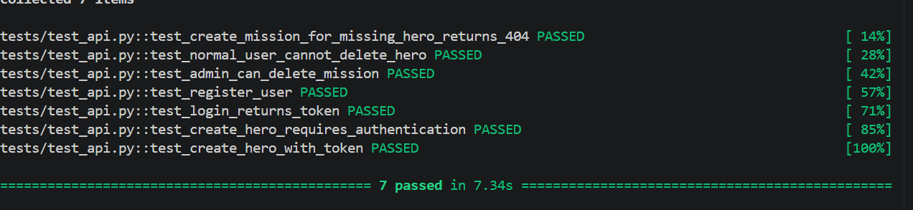

# FastAPI Heroes API

A beginner intership backend API project built with FastAPI, SQLModel, SQLAlchemy, JWT Authentication, Dependency Injection, and automated testing.

This project was designed as a learning-oriented but production-inspired backend architecture project focused on:

- REST API development
- Authentication & authorization
- Dependency Injection
- Relational DB & ORM
- CRUD operations
- Business validation rules
- Testing
- API design patterns
- Clean backend structure

---


## Database 

The project uses SQLite default database abstraction layer.

### Supported database 

The application was designed to support multiple SQL backends:

- SQLite Default
- PostgreSQL
- MySQL

via a shared `BaseDatabase` .

---

# Tech Stack

| Technology | Purpose |
|---|---|
| FastAPI | Web framework |
| SQLModel | ORM + Pydantic integration |
| SQLAlchemy | Database engine & session management |
| SQLite | Development database |
| JWT | Authentication |
| python-jose | JWT encoding/decoding |
| passlib | Password hashing BCrypt |
| pytest | Automated testing |
| TestClient | API endpoint testing |
| Pydantic | Request/response validation |
| Uvicorn | ASGI server |

---

# Project Structure

```text
fastapi_heroes/
│
├── app/
│   ├── main.py
│   ├── db.py
│   ├── security.py
│   ├── dependencies.py
│   │
│   ├── models/
│   │   ├── hero.py
│   │   ├── mission.py
│   │   └── user.py
│   │
│   ├── schemas/
│   │   ├── hero.py
│   │   ├── mission.py
│   │   └── user.py
│   │
│   └── routers/
│       ├── auth.py
│       ├── heroes.py
│       └── missions.py
│
├── tests/
│   └── test_api.py
│
├── requirements.txt
└── README.md
```

---

# Database Design

## Hero Model

```python
class Hero(SQLModel, table=True):
```

Stores hero information:

- id: int PK Auto Increment 
- name: str
- power: str
- level: int 
- active: bool

Relationship:

```text
Hero has Missions
(one-to-many) List[Mission] cascade all delete-orphan  
```

---

## Mission Model

```python
class Mission(SQLModel, table=True):
```

Stores:

- id: int PK Auto Increment 
- title: str
- difficulty: int
- completion : bool
- hero_id: int FK Hero

Relationship:

```text
Mission -> Hero
(many-to-one)
```

---

## User Model

Stores:

- id: int PK Auto Increment 
- username: str
- hashed password:  str
- is_admin: bool

Used for JWT authentication.

---

# Dependency Injection Architecture

One of the main goals of this project was learning FastAPI's dependency injection system.

The project heavily uses reusable dependencies for:

- database sessions
- authentication
- business rules
- reusable validation logic

---

## Session Dependency

```python
SessionDep = Annotated[
    Session,
    Depends(get_session)
]
```

Provides:

- one database session per request
- automatic cleanup
- transaction isolation

---

## Reusable Business Rule Dependencies

### Existing Hero Validation

```python
EXISTED_HERO = Annotated[
    Hero,
    Depends(get_existed_hero)
]
```

Used to:

- validate hero existence
- return hero by id or HTTP_404_NOT_FOUND
- Path dependence

Reusable across:

- GET
- PATCH
- DELETE

---

### Hero Completion Validation

```python
COMPLETED_HERO = Annotated[
    Hero,
    Depends(get_completed_hero)
]
```

Validates:

- hero has no active missions
- deletion business rules

### Existing Mission Validation

```python
EXISTED_MISSION = Annotated[
    Mission,
    Depends(get_existed_mission)
]
```

Used to:
- validate hero existence
- return hero by id or HTTP_404_NOT_FOUND
- Path Dependence

Reusable across:

- GET
- PATCH
- DELETE


---

# Authentication System

Authentication is implemented using:

- JWT tokens
- OAuth2PasswordBearer
- Password hashing BCrypt
- Protected dependencies

---

## Login Flow

1. User logs in
2. JWT token is generated
3. Client stores token
4. Protected endpoints validate token
5. Current user is injected into routes

---

## Current User Dependency

```python
CurrentUser = Annotated[
    User,
    Depends(get_current_user)
]
```

Automatically:

- validates JWT
- loads user from database
- raises HTTP 401 if invalid

---

## Admin Authorization

```python
CurrentAdmin = Annotated[
    User,
    Depends(get_current_admin)
]
```

Admin-only routes are protected through:

```python
CurrentAdmin
```

Used for:

- deleting heroes
- deleting missions
- privileged operations


---


---

# Database Session Lifecycle

The application follows a production-style pattern:

```text
1 Engine per application
1 Session per request
```

Flow:

```text
Request
 - get_session()
 - open session
 - route executes
 - session closes automatically
```

---

# Database Factory 

The project using a lru cache instance of chosen database SQLite by default

```python
class BaseDatabase
class SQLiteDatabase ✅
class PostgresDatabase
class MySQLDatabase
```

This architecture allows:

- multiple database backends
- reusable session logic
- clean dependency injection
- easier scaling

---

# Testing

The project includes API tests using:

- pytest
- FastAPI TestClient
- temporary SQLite database

---

## Tested Scenarios

- Create mission for missing hero returns 404
- Normal user cannot delete hero
- Admin can delete mission
- Register user
- Login returns access token
- Create hero requires authentication
- Create hero with valid token
---

## Passing Tests



---

# API Endpoints

## Authentication

| Method | Endpoint | Description | Access |
|---|---|---|---|
| POST | /auth/register | Register new user | Public |
| POST | /auth/login | Login user and return token | Public |
| GET | /auth/me | Get current user | Authenticated |

---

## Heroes

| Method | Endpoint | Description | Access |
|---|---|---|---|
| GET | /heroes | List heroes | Public |
| GET | /heroes/{id} | Get hero | Public |
| POST | /heroes | Create hero | Authenticated |
| PATCH | /heroes/{id} | Update hero | Authenticated |
| DELETE | /heroes/{id} | Delete hero | Admin Only |

---

## Missions

| Method | Endpoint | Description | Access |
|---|---|---|---|
| POST | /missions | Create mission for hero | Authenticated |
| GET | /missions | List missions | Public |
| GET | /missions/{mission_id} | Get mission | Public |
| PATCH | /missions/{mission_id} | Update mission | Authenticated |
| DELETE | /missions/{mission_id} | Delete mission | Admin Only |
---

# Concepts Learned

This project focused heavily on backend engineering concepts:

## Backend Concepts

- Reusable validation
- REST API architecture
- CRUD patterns
- Dependency Injection
- Request lifecycle
- ORM relationships
- Session management
- Transactions
- Authentication
- Authorization
- Business rules
- Testing

---

## FastAPI Concepts

- APIRouter
- Depends
- Annotated
- Lifespan events
- OAuth2PasswordBearer
- Response models
- HTTP status codes
- Request validation

---

## SQLModel / SQLAlchemy Concepts

- ORM relationships
- One-to-many relationships
- Many-to-one relationships
- Foreign keys
- Session lifecycle
- Engine architecture
- Transactions
- Database 

---

# Future Improvements

Possible future improvements include:

- Password rules (min length, special characters)
- Timestamps (created_at, updated_at, deleted_at)
- Exception Handler support custom Business Errors
- Environment configuration
- Alembic migrations
- Async implementation
- PostgreSQL integration
- Docker support
- Role-based permissions
- Pagination utilities
- Structured logging
- Rate limiting
- refresh token
- Background tasks on logging create/update/delete
- OpenAPI documentation customization
- Service layer architecture 


---

# Business Domain & Gameplay Expansion Ideas

The current application focuses on core CRUD operations, authentication, reusable dependencies, and backend architecture patterns.  
Future iterations could evolve the project into a  multi-user mission management system with richer business logic and domain rules.

Possible domain-oriented improvements include:

- Heroes made by user (`owner_id`) GET /heroes/my
- Owner/admin authorization rules
- Audit trails for user actions
- AI-generated missions or descriptions
- Semantic search for missions
- Mission status enum (`pending`, `active`, `completed`, `failed`)
- Hero experience and leveling system auto-leveling by complete n missions.
- Difficulty restrictions based on hero level
- Mission history tracking
- Hero/Mission stats
- Active mission limits per hero
- Keep missions history after hero deletion 
- Achievement / badge system
- Search, filtering, endpoints
- Multi-role permission system and RBAC
- Notification and event systems
- Statistics and analytics endpoints

These improvements would shift the project from a CRUD-focused educational API into a domain-driven backend application with richer business rules and relationships.

# Running The Project

## Requirements

- Python 3.11+
- pip

---

## Create a Virtual Environment

```bash
python -m venv venv
```

---

## Activate the Virtual Environment

### Windows

```bash
venv\Scripts\activate
```


## Install dependencies

```bash
pip install -r requirements.txt
```

---

## Start the server

### Option 1 — Uvicorn

```bash
uvicorn app.main:app --reload
```

### Option 2 — FastAPI CLI

```bash
fastapi dev app/main.py
```
The API will be available at:

```text
http://127.0.0.1:8000
```

---

## Open Swagger Docs

```text
http://127.0.0.1:8000/docs
```

---

# Run Tests

```bash
python -m pytest tests/test_api.py -v
```

---

# Educational Purpose

This project was created primarily as:

- a tutorial exercise project with archtecture rules constraint
- a learning, practice project 
- an introduction to FastAPI development
- a backend architecture practice project
- not so as portfolio backend API project

It focuses heavily on understanding:

- backend design patterns
- dependency injection
- session lifecycle
- authentication
- reusable validation architecture
- testing workflows

rather than only implementing CRUD endpoints.

---

